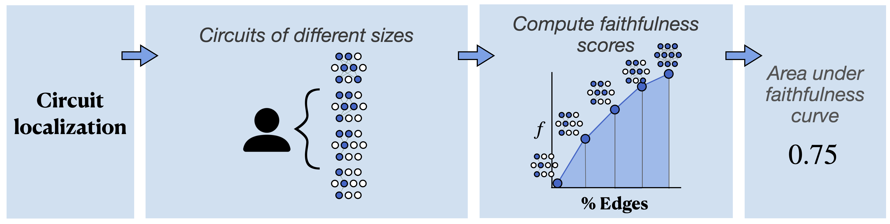

<p align="center">
    <a>
        
    </a>
</p>

<p align="center">
    This repository provides code for the <b>circuit localization track</b>, including code for circuit discovery and evaluation.
    <br/>
    <sub>
        <strong>circuits · localization · faithfulness</strong>
    </sub>
</p>

<p align="center" style="color: #cccccc">
    <a href="LICENSE.md"></a>
    <a href="https://huggingface.co/mech-interp-bench"></a>
    <a href="https://huggingface.co/spaces/mech-interp-bench/leaderboard"></a>
    <a href="mailto:mueller@technion.ac.il"></a>
    <a href="TODO"></a>
</p>

# Dependencies
This code has no dependencies beyond those of `EAP-IG`, which should be pulled () and installed (`pip install EAP-IG`). EAP-IG will install its own dependencies, `transformer-lens >= 2.11.0` and `matplotlib`; if you wish to visualize the circuits you find, please use `pip install EAP-IG[viz]`, which will also install the necessary `pygraphviz` package. Our code was tested using `torch == 2.4.1`.

# Circuit Discovery
<p align="center">
    <a>
    
    </a>
</p>

Here, we describe how to run the circuit discovery methods that we compare in the paper. In general, you can run circuit discovery by running:

```
python run_attribution.py
--models [MODELS]
--tasks [TASKS]
--method [METHOD]
--level [LEVEL='edge']
--ablation [ABLATION="patching"]
--batch-size [BATCH_SIZE=20]
--circuit-dir [CIRCUIT-DIR="circuits/"]
```

This will iterate over each model and task specified, producing an attribution graph file for each. The `ablation` option controls the ablation used - by default patching ablations, but `mean` and `zero` ablations are also possible. `level` is the level of granularity at which attribution is performed: `edge` (by default) or `node` / `neuron`. `batch-size` is the batch size used during attribution, and is set across models. `circuit-dir` is where circuit files are output, in the format 

We support the following attribution methods: 

- **Edge Attribution Patching (EAP; `eap`).** Note that by changing `--level` to `node` or `neuron`, you obtain node / neuron attribution patching.

- **EAP with Optimal Ablations** You will first need to compute the optimal ablations vector given a model and task. This can be done by running `oa.py`. Then, run `python run_attribution.py` with `--method EAP --ablation optimal`.

- **Edge Attribution Patching with Integrated Gradients (EAP-IG; `eap-ig-inputs` / `eap-ig-activations`).**  EAP-IG-inputs runs an interpolation between many values of the input embeddings, but allows the activations to flow freely through the rest of the model from there. EAP-IG-activations interpolates between intermediate activations at the component that is being attributed. We would recommend starting with EAP-IG-inputs, as it runs faster—and, in most cases, performs better.

- **Activation Patching (`exact`).** This is the exact activation patching approach that EAP is approximating. Its runtime is long, so it is generally only feasible to run on smaller models unless you have a large enough GPU to increase the batch size significantly. Note that this approach operates at the level of edges, not nodes.

- **Information Flow Routes (IFR; `information-flow-routes`).**

- **Uniform Gradient Sampling (UGS).** We provide a script for running UGS, but this must be run separately.

# Evaluation
To evaluate these circuits, run
```run_evaluation.py
--models [MODELS]
--tasks [TASKS]
--split [SPLIT='validation']
--level [LEVEL='edge']
--ablation [ABLATION="patching"]
--batch-size [BATCH_SIZE=20]
--circuit-dir [CIRCUIT-DIR="circuits/"]
``` 
By default, this will evaluate on the validation set. To evaluate on the public test set, use `--split test`.

The argument structure is the same as for the attribution script, so simply port the same arguments you used when running circuit discovery while changing the python script. This will load circuits from the locations they would have been saved in when running the circuit discovery method described above.

If you are using custom circuits not obtained using this code, use the `--circuit-paths` argument. This takes a series of space-separated paths to circuits to be evaluated. These circuits must be provided in either .json or .pt format; see examples provided here. 

This script will save your results in a .pkl file containing the faithfulness scores at all circuit sizes, the weighted edge counts of all circuits, and the CPR and CMD scores.

# Submitting to the MIB Leaderboard
If you would like to submit your circuits for evaluation on the private test set and upload to the leaderboard, please start by collecting your circuits. We expect one of two things for each task/model: either (1) a single .json or .pt file with floating-point importance scores assigned to each node or edge in the model, or (2) 10 .json or .pt files with binary membership variables assigned to each node or edge in the model. If (2), there should be one circuit containing between each of the following percentages of edges:

```{0, 0.1, 0.2, 0.5, 1, 2, 5, 10, 20, 50}```

In other words, we expect one circuit with $0 < k \leq 0.1$ edges, one with $0.1 < k \leq 0.2$ edges, etc., where $k$ is the number of edges in the circuit as a percentage of edges in the full model.

We require the circuits to be publicly available on HuggingFace. We will request a URL to a directory in a HuggingFace repository that contains one folder per task/model. Each folder should contain the name of the model and the name of the task separated with an underscore—for example, `ioi_gpt2`, or `arc-easy_llama3`. These folders should contain either your importance scores or your 10 circuits. We provide an example at TODO. You do not need to provide folders for all tasks/models; however, to prevent trivial submissions, we require you to provide circuits for $\geq$ 2 models, and $\geq$ 2 tasks.

Note that there is a rate limit of 2 submissions per user per week to prevent hill-climbing on the private test set. Our automatic submission checker will verify whether what you have provided is in a valid format, and *only* count your submission toward your limit if it is. In case of issues, we ask that you provide a contact email.


## Citation
If you use the resources in this repository, please cite our paper:
```
@article{mib-2025,
    title = {{MIB}: A Mechanistic Interpretability Benchmark},
    author = {Aaron Mueller and Atticus Geiger and Sarah Wiegreffe and Dana Arad and Iv{\'a}n Arcuschin and Adam Belfki and Yik Siu Chan and Jaden Fiotto-Kaufman and Tal Haklay and Michael Hanna and Jing Huang and Rohan Gupta and Yaniv Nikankin and Hadas Orgad and Nikhil Prakash and Anja Reusch and Aruna Sankaranarayanan and Shun Shao and Alessandro Stolfo and Martin Tutek and Amir Zur and David Bau and Yonatan Belinkov},
    year = {2025},
    note = {To appear},
    journal = {arXiv preprint}
}
```

# License
We release the content in this repository under an Apache 2.0 license.